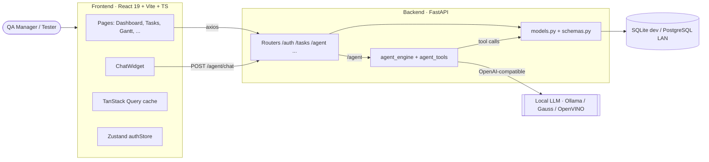
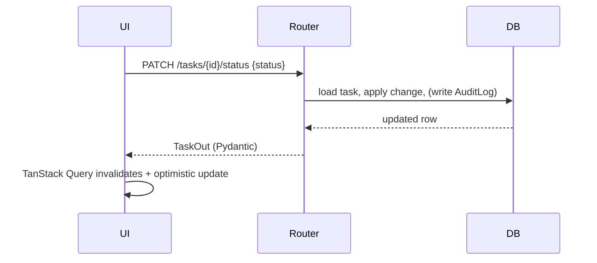

# Architecture

Describes the system as it is, plus the seams where the QAOS evolution plugs in.

## System shape

Key property to preserve: **the AI reaches the database only through `agent_tools`**,
which use the same models/session as the routers. One data path, one place to audit.

## Backend

- **Entry:** `app/main.py` builds the `FastAPI` app, runs `Base.metadata.create_all` on
  import, mounts all routers, and exposes `GET /health`.
- **Config:** `app/config.py` — `pydantic-settings` reading `.env` (DATABASE_URL,
  SECRET_KEY, JWT settings, EMAIL_*, UPLOAD_DIR, AGENT_ENABLED, LLM_*).
- **DB layer:** `app/database.py` — `engine`, `SessionLocal`, `Base`, and the `get_db`
  dependency. Routers depend on `get_db`; no ORM objects leak past the router boundary
  un-serialized (Pydantic schemas in `schemas.py` handle I/O).
- **Auth:** `app/auth.py` — bcrypt hashing, JWT issue/verify, and FastAPI dependencies
  for "current user" and role checks.
- **Routers:** thin; one file per resource. Business rules live in the router or a small
  helper today (there is no separate service layer yet — keep new logic close to the
  existing pattern unless a feature clearly warrants extracting one, which is an ADR).
- **AI:** `agent_engine.py` holds `SYSTEM_PROMPT`, the `TOOLS` JSON schemas, `TOOL_FN_MAP`,
  and `run_agent()`; `agent_tools.py` holds the functions. See `AI_ASSISTANT.md`.
- **Cross-cutting:** `AuditLog` (field-level change history) and `Notification` models
  already exist; `email_service.py` sends optional SMTP notifications.

### Request flow (typical mutation)

## Frontend

- **Data:** every server resource is a TanStack Query hook wrapping an `api/` function
  (axios). Mutations invalidate the relevant query keys; prefer optimistic updates.
- **Auth/session:** Zustand `authStore` holds the JWT + current user; axios attaches the
  token; a guard redirects unauthenticated users to `/login`.
- **UI:** Radix primitives styled with Tailwind v4; shared wrappers in
  `components/shared/` (Modal, Badge, Avatar, ConfirmDialog). Icons via `lucide-react`,
  toasts via `react-hot-toast`.
- **Pages** map 1:1 to modules; the AI **ChatWidget** floats on every page.
- **Gantt (since E2):** `pages/GanttView.tsx` hosts the custom editable timeline
  (`components/gantt/GanttWorkspace.tsx`, ADR-0004): virtualized assignee-grouped rows,
  drag-move/edge-resize/dependency-draw/drag-reassign persisted through the E1
  endpoints with optimistic updates, inline title edit, right-click menu, multi-select,
  undo/redo command stack, critical-path highlight, workload heatmap, day/week/month
  zoom, color-by. Fed by the enriched `GET /tasks/gantt`.

## The evolution seams (where new work attaches)

| Capability (target) | Attaches at |
|---------------------|-------------|
| Real dependencies + critical path | **done (E1)** — `task_dependencies` table (ADR-0005) + framework-free `app/scheduling.py` (CPM, working calendars, cycle rejection) |
| Editable Gantt workspace | **done (E2)** — custom timeline in `components/gantt/` (ADR-0004) consuming the E1 endpoints with optimistic updates + undo/redo |
| Stronger AI assistant | new functions in `agent_tools.py` + schemas in `TOOLS` + `TOOL_FN_MAP` |
| AI planner / simulator | new agent tools + a non-destructive "scenario" path over the scheduling module |
| Explainable AI | `run_agent` returns rationale + confidence alongside `actions` |
| Migrations | **done (E0)** — Alembic with a baseline revision; every schema change ships a migration (ADR-0003, `backend/README.md`) |

## Deployment (current)

Dev: SQLite + `uvicorn --reload` + Vite dev server. LAN/prod: PostgreSQL, built frontend
served behind a reverse proxy, LLM served on-prem. Containerization is not yet in the
repo; adding Docker Compose is a reasonable early roadmap item (and an ADR).
